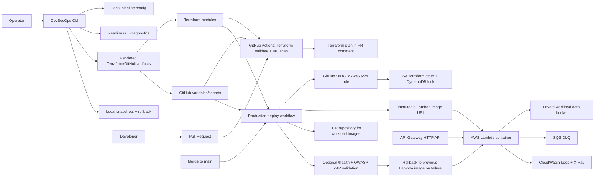

# DevSecOps Pipeline Kit CLI for AWS Lambda


DevSecOps Pipeline Kit is a terminal-first product for configuring,
validating, and operating a secure AWS Lambda deployment pipeline. The CLI is
the primary user interface; Terraform, GitHub Actions, AWS OIDC, scanners, and
rollback logic are the execution layer that the CLI configures and checks.

Use the CLI to build a local pipeline configuration, render Terraform and
GitHub helper artifacts, inspect readiness, diagnose GitHub/AWS setup gaps, and
recover from local configuration changes with snapshots.

This repository does not include sample Lambda application source code. The
pipeline expects a prebuilt immutable Lambda container image through
`LAMBDA_IMAGE_URI`.

## Development Status

This project is in early alpha and is changing quickly. The CLI is usable for
experimentation, review, demos, and guided pipeline setup, but it should not be
treated as a stable platform yet.

Expect frequent releases while the project moves toward `v1.0`. Command names,
configuration fields, generated artifacts, operational diagnostics, and
security controls may change across `0.x` versions as the product boundary gets
sharper. Pin a release tag for repeatable demos or evaluations, read the
[Changelog](CHANGELOG.md) before upgrading, and review generated Terraform and
GitHub artifacts before applying them in real AWS accounts.

Security is an active development area. GitHub OIDC, immutable image inputs,
Terraform validation, IaC scanning, optional Snyk, optional `/health`
validation, optional DAST, and rollback behavior are already present, but the
controls, defaults, and audit outputs are still evolving. Follow the
[Roadmap](ROADMAP.md) to see what is implemented, what is next, and what is not
yet considered stable.

## Product Contract

The product boundary is intentionally narrow: `devsecops` is the user-facing
CLI for creating, validating, rendering, and diagnosing a secure AWS Lambda
delivery pipeline. Terraform modules, GitHub Actions workflows, AWS resources,
and scanners remain transparent execution layers that the CLI configures and
checks.

`.devsecops-pipeline.toml` is local source configuration. Files written by
`devsecops render`, `devsecops report`, and `devsecops github-setup --write`
are CLI-owned generated artifacts. Do not edit generated files directly for
durable changes; update the local config and regenerate them.

Stable command flags, compatibility aliases, experimental commands, JSON output
kinds, config migration rules, and generated artifact compatibility are
documented in [Stability contract](docs/stability-contract.md). The
machine-readable inventory is available with:

```bash
devsecops inventory --format json
```

## Architecture



## What Is Implemented

| Area | Implementation |
| --- | --- |
| CLI product | Dependency-free terminal menu, setup wizard, readiness dashboard, config presets, reports, snapshots, rollback, and diagnostics. |
| CLI-managed config | `.devsecops-pipeline.toml` stores local settings and `devsecops render` generates ignored Terraform/GitHub helper artifacts. |
| Readiness diagnostics | `devsecops readiness`, `[i] details`, `doctor`, `gh-doctor`, `actions-status`, and `branch-doctor` explain what blocks a deploy-ready pipeline. |
| AWS diagnostics | `devsecops aws-doctor` checks AWS identity, backend bucket, lock table, ECR, Lambda execution role, Lambda, API Gateway, CloudWatch logs, and configured ECR image existence. |
| Environments | `dev`, `staging`, and `prod` are mapped to Terraform workspaces. Resource names include the environment, for example `devsecops-pipeline-prod-lambda`. |
| Terraform state | Remote S3 backend with DynamoDB locking. `terraform/bootstrap` creates both prerequisites with encrypted state and public access blocked. |
| IaC structure | Root Terraform composes modules in `terraform/modules`: `kms`, `storage`, `ecr`, `lambda`, and `api-gateway`. |
| PR workflow | Pull requests run Terraform formatting, validation, and Trivy IaC scanning. Same-repository PRs also run an AWS-backed Terraform plan with the plan role and publish a PR comment plus artifact. |
| Production deploy | `terraform apply` runs only from manual `workflow_dispatch` with `mode=deploy`, `environment=prod`, and the workflow run started from `main`. Direct pushes do not start Actions. |
| Image deployment | The deploy workflow and Terraform require an explicit immutable `LAMBDA_IMAGE_URI` and reject mutable `latest` or `bootstrap` tags. |
| Container scanning | Snyk can scan the configured image when `SNYK_TOKEN` is present. |
| Rollback | The deploy job captures the previous Lambda image URI and restores it automatically if apply or enabled validation fails. |
| Optional validation | `/health` smoke test and OWASP ZAP baseline DAST can be enabled with repository variables. |

## Repository Layout

```text
pyproject.toml                      Root Python package metadata for `pipx install .`
cli/devsecops_cli/                  Installable CLI package and module entry point
cli/tests/                          Focused CLI unit tests
dist/devsecops/                     Ignored CLI-rendered helper artifacts
.github/workflows/deploy.yml        CI, PR plan, production deploy, rollback, optional DAST
.github/workflows/release.yml       Tag release workflow with wheel/sdist artifacts
terraform/bootstrap/                One-time S3 backend and DynamoDB lock table
terraform/modules/kms/              Customer-managed KMS key and alias
terraform/modules/storage/          Private workload data bucket and access log bucket
terraform/modules/ecr/              Immutable ECR repository and lifecycle policy
terraform/modules/lambda/           Lambda, IAM role, logs, and SQS DLQ
terraform/modules/api-gateway/      HTTP API, integration, stage, access logs
docs/                               CLI-first security, scanner, cost, and troubleshooting docs
```

## Quick Start

Install the latest published release with Python 3.11, 3.12, or 3.13 and
`pipx`:

```bash
PYTHON="${PYTHON:-python3.11}"

"${PYTHON}" -m pip install --user pipx
"${PYTHON}" -m pipx ensurepath
export PATH="$HOME/.local/bin:$PATH"

WHEEL_URL="$(
  "${PYTHON}" - <<'PY'
import json
import urllib.request

repo = "tidyOpposite/devsecops-serverless-aws-lambda"
with urllib.request.urlopen(f"https://api.github.com/repos/{repo}/releases/latest") as response:
    release = json.load(response)

for asset in release["assets"]:
    if asset["name"].endswith("-py3-none-any.whl"):
        print(asset["browser_download_url"])
        break
else:
    raise SystemExit("No wheel asset found on the latest release.")
PY
)"

"${PYTHON}" -m pipx install --python "${PYTHON}" "devsecops-pipeline-cli @ ${WHEEL_URL}"
devsecops menu
```

See [Distribution and compatibility](docs/distribution.md) for pinned install,
upgrade, shell completion, checksum verification, and supported tool versions.

The main menu uses section-style navigation: selecting an item clears the
terminal, opens that section, and returns to the main menu when you press
Enter. Input sections can be cancelled by typing `b`, `back`, `0`, or
`cancel`; the configuration wizard returns without saving when cancelled. The
readiness indicator includes an `[i] details` shortcut that shows the checks
blocking 100% readiness and the concrete fix for each one.

For development, install the local package in editable mode:

```bash
PYTHON="${PYTHON:-python3.11}"
"${PYTHON}" -m pip install -e .
devsecops dashboard
```

Without installing, run the package module with `PYTHONPATH`:

```bash
PYTHON="${PYTHON:-python3.11}"
PYTHONPATH=cli "${PYTHON}" -m devsecops_cli dashboard
```

Recommended first run:

```bash
devsecops next
devsecops start --preset balanced
```

Non-interactive first run:

```bash
devsecops config new --preset balanced
devsecops config validate
devsecops config diff
devsecops dry-run --image-uri 123456789012.dkr.ecr.us-east-1.amazonaws.com/devsecops-pipeline-prod-lambda-repo:sha-abc123
devsecops render
devsecops readiness
devsecops report
devsecops evidence collect --rc
```

The CLI is intentionally dependency-free for core flows, so it can run before a
Python environment, Terraform backend, GitHub repository, or AWS credentials are
fully configured.

The same first-run path is also shown in `devsecops --help`.

Useful commands:

```bash
devsecops dashboard     # full terminal dashboard with readiness categories
devsecops dashboard --mode compact
devsecops dashboard --watch --interval 10
devsecops tui           # optional Rich/Textual UI bridge

devsecops config new --preset balanced # create clean local source config
devsecops config show --format toml
devsecops config show --format json
devsecops config validate
devsecops config diff
devsecops config diff --preset strict
devsecops config set backend.bucket my-state-bucket --render
devsecops config reset --preset minimal
devsecops config schema

devsecops preset list   # show available policy profiles
devsecops preset show strict
devsecops preset apply strict --render

devsecops doctor local --format compact
devsecops doctor local --deep --format json
devsecops doctor github
devsecops doctor aws --environment prod --strict
devsecops doctor branch --branch main
devsecops doctor actions --format json
devsecops doctor all --format compact
devsecops readiness     # shows what blocks 100% readiness
devsecops readiness --format json
devsecops readiness --strict --format compact
devsecops dry-run --image-uri <immutable-ecr-image-uri>
devsecops preflight --image-uri <immutable-ecr-image-uri>
devsecops health --url https://abc123.execute-api.us-east-1.amazonaws.com/health
devsecops aws outputs --environment prod --format json

devsecops github setup  # prints gh commands for repo variables/secrets
devsecops github setup --apply --deploy-role-arn arn:aws:iam::123456789012:role/deploy
devsecops github status --format compact
devsecops github branch --branch main

devsecops terraform bootstrap
devsecops terraform bootstrap --apply
devsecops terraform plan dev --create-workspace

devsecops snapshot list
devsecops snapshot show 1
devsecops snapshot restore --last --dry-run

devsecops envs          # environment settings table
devsecops controls      # security controls matrix
devsecops inventory --format json # stable command/JSON/artifact contract
devsecops next          # show the single next setup action for this repo
devsecops start --preset balanced # guided safe onboarding flow
devsecops evidence collect --rc # collect local release-candidate evidence
devsecops completion bash # print shell completion for bash, zsh, or fish
devsecops render        # writes ignored Terraform/GitHub helper artifacts
devsecops render --dry-run
devsecops report        # exports Markdown readiness report
devsecops report --format json # exports attachable audit evidence
devsecops explain oidc  # explains a security control
```

Top-level compatibility aliases such as `init`, `set`, `validate-config`,
`github-setup`, `gh-doctor`, `aws-doctor`, `actions-status`, `branch-doctor`,
`plan`, `bootstrap`, `snapshots`, and `rollback` still work. New scripts should
prefer the grouped commands shown above.

The dashboard splits readiness into Local, Terraform, GitHub, AWS, Security,
and Deployment scores. `--mode compact` keeps the view short; `--watch`
auto-refreshes every `--interval` seconds.

The core CLI remains dependency-free. To try the optional Rich/Textual UI:

```bash
python3.11 -m pipx inject devsecops-pipeline-cli "rich>=13.7" "textual>=0.79"
devsecops tui
```

From a local checkout, `pipx install ".[tui]"` also works.

The clean configuration workflow writes `.devsecops-pipeline.toml`, which is
intentionally ignored by Git and includes `schema_version = 1`.
`devsecops render` writes:

```text
terraform/generated.auto.tfvars
dist/devsecops/backend.tf
dist/devsecops/github-variables.env
dist/devsecops/github-setup.sh
dist/devsecops/setup-checklist.md
```

`devsecops report` writes `dist/devsecops/readiness-report.md`.
`devsecops report --format json` writes `dist/devsecops/audit-report.json`
for pull request, workflow artifact, or release evidence.

Generated artifacts include CLI-owned headers and are ignored by Git. See
[Generated artifacts](docs/generated-artifacts.md) for the source-versus-output
contract.

The CLI creates local snapshots before commands that overwrite CLI-owned
configuration or generated artifacts: `init`, `compose`, `set`, `preset`,
`render`, `report`, and `github-setup --write`. Snapshots are stored under
`.devsecops/snapshots/`, are ignored by Git, and can be inspected or restored:

```bash
devsecops snapshots
devsecops snapshots --show 1
devsecops rollback --last --dry-run
devsecops rollback --to <number-or-id>
```

Rollback restores only the local files managed by the CLI, such as
`.devsecops-pipeline.toml`, `terraform/generated.auto.tfvars`, and generated
files under `dist/devsecops/`. Before a rollback is applied, the CLI creates a
new safety snapshot of the current state. It does not change AWS Lambda,
Terraform state, GitHub Actions, or deployed traffic. Cloud deployment rollback
is handled by the production GitHub Actions workflow when apply or validation
fails.

## Operational Diagnostics

After a deploy, inspect the live AWS surface without mutating resources:

```bash
devsecops aws outputs --environment prod
devsecops health
devsecops health --url https://abc123.execute-api.us-east-1.amazonaws.com/health
devsecops github status --format compact --strict
```

`github status` and `doctor actions` show failed jobs, failed steps, concrete
next actions, and runbook links. Use `readiness --strict` in CI when any scored
gap should fail the command.

For release review or production proof, collect an attachable evidence bundle
with the commands in
[Production deployment evidence](docs/production-deployment-evidence.md). The
bundle captures release verification, strict config/readiness output, GitHub
setup, workflow status, Terraform outputs, AWS outputs, health checks,
CloudWatch logs, and rollback readiness.

The `set` command supports non-interactive configuration for scripts and quick
edits:

```bash
devsecops set lambda_image_uri 123456789012.dkr.ecr.us-east-1.amazonaws.com/app:sha-a1b2c3
devsecops set enable_dast true
devsecops set environments.prod.lambda_timeout 300 --render
devsecops config validate
devsecops config validate --strict
```

Presets provide a quick starting point:

```bash
devsecops preset list
devsecops preset show enterprise
devsecops preset apply minimal --render       # low-cost local/dev experimentation
devsecops preset apply balanced --render      # default reference settings
devsecops preset apply strict --render        # enables health validation and DAST
devsecops preset apply enterprise --render    # locked-down CORS and longer retention
devsecops preset apply student-demo --render  # simple demonstration profile
```

For compatibility, `devsecops preset strict --render` still applies the named
preset, but new scripts should use `devsecops preset apply <name>`.

Each preset has a documented security posture and can be compared with
`devsecops preset list`. Use
[Security controls and policy presets](docs/security-controls.md) for the full
control catalog, preset comparison, strict validation rules, and audit evidence
format.

Use the pipeline composer when you want the CLI to ask for individual controls
and then update all generated outputs in one pass:

```bash
devsecops compose
```

Composer asks whether to enable Snyk container scanning, DAST, health checks,
strict CORS, the protected `prod` approval environment, and a separate AWS plan
role. It updates `.devsecops-pipeline.toml`, renders Terraform/GitHub helper
artifacts, and writes `dist/devsecops/readiness-report.md`.

## CLI-Managed Backend Bootstrap

Terraform cannot create the S3 backend it is already using. Configure the
backend values through the CLI, render helper artifacts, and let the CLI run the
bootstrap stack:

```bash
devsecops set backend.bucket <globally-unique-state-bucket> --render
devsecops set backend.lock_table devsecops-pipeline-terraform-locks --render
devsecops bootstrap
devsecops bootstrap --apply
```

`devsecops bootstrap` plans by default. Use `--apply` only after reviewing the
target AWS account, bucket name, and lock table name.

The rendered backend template is written to `dist/devsecops/backend.tf`. Copy
or adapt it into `terraform/backend.tf` when you are ready to initialize the
root Terraform module:

```hcl
terraform {
  backend "s3" {
    bucket               = "<globally-unique-state-bucket>"
    key                  = "serverless-lambda/terraform.tfstate"
    region               = "us-east-1"
    encrypt              = true
    dynamodb_table       = "devsecops-pipeline-terraform-locks"
    workspace_key_prefix = "environments"
  }
}
```

## Environment Workflow

Use the CLI for the normal environment workflow:

```bash
devsecops envs
devsecops preset apply balanced --render
devsecops plan dev --create-workspace
devsecops plan staging --create-workspace
devsecops plan prod --create-workspace
```

The CLI delegates to Terraform workspaces under the hood. The active workspace
selects `environment_config` from `terraform/variables.tf`. Running in the
default workspace falls back to `var.environment`, which defaults to `dev`.

## GitHub Actions Setup

Generate repository setup commands from the same local config used by
Terraform:

```bash
devsecops github-setup --write
devsecops gh-setup --apply \
  --deploy-role-arn arn:aws:iam::<account-id>:role/<deploy-role> \
  --plan-role-arn arn:aws:iam::<account-id>:role/<plan-role>
devsecops gh-doctor
devsecops branch-doctor
devsecops aws-doctor --environment prod
```

Required repository secrets:

| Secret | Purpose |
| --- | --- |
| `AWS_ROLE_TO_ASSUME_ARN` | Deployment role used by manual production deploy runs from `main`. |
| `AWS_PLAN_ROLE_TO_ASSUME_ARN` | Required least-privilege role for Terraform plan workflows. Plans do not fall back to the deploy role. |
| `AWS_REGION` | AWS region, for example `us-east-1`. |
| `SNYK_TOKEN` | Required when `ENABLE_SNYK_SCAN=true`; otherwise optional. |

Repository variables:

| Variable | Default | Purpose |
| --- | --- | --- |
| `PROJECT_NAME` | `devsecops-pipeline` | Prefix for AWS resources and ECR repository names. |
| `LAMBDA_IMAGE_URI` | none | Required for manual production deploy. Immutable image URI deployed to Lambda. |
| `ENABLE_SNYK_SCAN` | `false` | When `true` and `SNYK_TOKEN` is present, CI scans the configured image with Snyk. |
| `ENABLE_HTTP_VALIDATION` | `false` | When `true`, CI calls the API Gateway `/health` URL after deployment. |
| `ENABLE_DAST` | `false` | When `true`, CI runs OWASP ZAP baseline scan against the API Gateway invoke URL. |
| `PROD_APPROVAL_ENVIRONMENT` | `prod` | GitHub environment used by the production deploy job. Composer sets `devsecops-no-approval` when approval is disabled. |

Recommended branch protection for `main`:

* Require pull requests before merging.
* Require `Security and Terraform Validate` and `Terraform Plan` to pass.
* Use pull requests from branches in this repository for automatic AWS-backed
  Terraform plans. Pull requests from forks still run validation, but the
  AWS-backed plan job is skipped.
* Direct pushes to `main` do not run this workflow.

Use separate AWS roles for plan and deploy. The plan role should read backend
state, acquire locks, and describe resources for Terraform refresh; it should
not mutate workload resources. The deploy role is reserved for approved manual
production deploys from `main`. See [AWS IAM policy guidance](AWS_policy.md)
and [Security controls and policy presets](docs/security-controls.md).

## Pipeline Behavior

| Event | Environment | Terraform action | Deployment |
| --- | --- | --- | --- |
| Pull request to `main` from same repository | `dev` | `plan` only with `AWS_PLAN_ROLE_TO_ASSUME_ARN` | No apply. |
| Pull request to `main` from fork | n/a | validation only | No AWS credentials. |
| Push to `main` | n/a | none | No workflow run. Maintainer pushes do not consume Actions minutes. |
| Manual `workflow_dispatch`, `mode=plan` | selected `dev/staging/prod` | `plan` only | No apply. |
| Manual `workflow_dispatch`, `mode=deploy`, `environment=prod`, branch `main` | `prod` | `apply` | Scan configured image when enabled, deploy Lambda, optionally validate HTTP and DAST, rollback on failure. |
| Push tag `v*.*.*` | n/a | n/a | Publish GitHub Release from `docs/release-<tag>.md` or `CHANGELOG.md` with wheel, source distribution, and `SHA256SUMS`. |

## Deployment Flow

For a command-by-command walkthrough with expected output, see
[First successful pipeline](docs/first-successful-pipeline.md). For a
production-proof release record, use
[Production deployment evidence](docs/production-deployment-evidence.md).

1. Configure local pipeline state with `devsecops compose`, `init`, `set`, or
   `preset`.
2. Render generated artifacts with `devsecops render`.
3. Check readiness with `devsecops readiness`, `doctor`, and GitHub diagnostics.
4. Validate Terraform formatting and configuration in GitHub Actions on pull
   requests or manual runs.
5. Run Trivy IaC scanning.
6. Require an immutable `LAMBDA_IMAGE_URI` on production deploys; Terraform also
   prevents planning or applying the Lambda workload without an explicit
   immutable image URI.
7. Optionally scan the configured Lambda image with Snyk.
8. Apply KMS and ECR bootstrap targets so supporting resources exist.
9. Capture the previously deployed Lambda image URI.
10. Start a manual `workflow_dispatch` run with `mode=deploy` and
    `environment=prod` from `main`.
11. Apply the full Terraform workload with the configured image URI.
12. Wait for the Lambda update to complete.
13. Optionally call `/health` and run OWASP ZAP baseline DAST.
14. If deployment validation fails, update Lambda back to the previous image
    and re-apply Terraform with the previous URI to remove state drift.

## Workload Image Contract

The supplied image must be compatible with Lambda container package type and
must be published before the production deploy workflow runs. Use immutable tags
or image digests; do not use `latest` or `bootstrap`.

Validate the image URI locally before writing it into config:

```bash
devsecops preflight --image-uri 123456789012.dkr.ecr.us-east-1.amazonaws.com/devsecops-pipeline-prod-lambda-repo:sha-abc123
```

The bring-your-own-image path is documented in
[Bring your own Lambda image](docs/bring-your-own-image.md). Keep example or
real workload source in a separate repository; use
[Separate example workload template](docs/example-workload-template.md) as the
repository contract.

If `ENABLE_HTTP_VALIDATION=true`, the image must handle API Gateway HTTP API
events and return a successful response for `GET /health`. If
`ENABLE_DAST=true`, the API should be safe for a passive OWASP ZAP baseline
scan.

## Useful Terraform Outputs

Example shape after a successful `prod` deploy:

```text
environment = "prod"
terraform_workspace = "prod"
api_gateway_health_url = "https://abc123.execute-api.us-east-1.amazonaws.com/health"
api_gateway_invoke_url = "https://abc123.execute-api.us-east-1.amazonaws.com/"
ecr_repository_name = "devsecops-pipeline-prod-lambda-repo"
ecr_repository_url = "123456789012.dkr.ecr.us-east-1.amazonaws.com/devsecops-pipeline-prod-lambda-repo"
lambda_function_name = "devsecops-pipeline-prod-lambda"
output_s3_bucket_name = "devsecops-pipeline-prod-workload-data-123456789012"
```

Health check, when the workload implements `/health`:

```bash
curl "$(terraform output -raw api_gateway_health_url)"
devsecops health
```

## Reference Documents

* [Security model](docs/security-model.md)
* [Security controls and policy presets](docs/security-controls.md)
* [Scanning tool rationale](docs/scanning-tools.md)
* [AWS cost estimation](docs/cost-estimation.md)
* [Troubleshooting guide](docs/troubleshooting.md)
* [Product roadmap](ROADMAP.md)
* [Command inventory](docs/command-inventory.md)
* [Stability contract](docs/stability-contract.md)
* [Generated artifacts](docs/generated-artifacts.md)
* [First successful pipeline](docs/first-successful-pipeline.md)
* [Production deployment evidence](docs/production-deployment-evidence.md)
* [v1.0.0 release candidate checklist](docs/v1.0.0-release-candidate-checklist.md)
* [Bring your own Lambda image](docs/bring-your-own-image.md)
* [Separate example workload template](docs/example-workload-template.md)
* [Operational runbooks](docs/runbooks/README.md)
* [AWS OIDC and IAM policy guidance](AWS_policy.md)
* [Distribution and compatibility](docs/distribution.md)
* [Release checklist](docs/release-checklist.md)
* [Upgrade guide](docs/upgrade-guide.md)
* [Known limitations](docs/known-limitations.md)
* [Changelog](CHANGELOG.md)
* [v0.11.0 release notes](docs/release-v0.11.0.md)
* [v0.8.0 release notes](docs/release-v0.8.0.md)
* [v0.7.0 release notes](docs/release-v0.7.0.md)
* [v0.6.1 release notes](docs/release-v0.6.1.md)
* [v0.6.0 release notes](docs/release-v0.6.0.md)
* [v0.5.0 release notes](docs/release-v0.5.0.md)
* [v0.4.1 release notes](docs/release-v0.4.1.md)
* [v0.4.0 release notes](docs/release-v0.4.0.md)
* [v0.3.0 release notes](docs/release-v0.3.0.md)
* [v0.2.0 release notes](docs/release-v0.2.0.md)
* [v0.1.0 release notes](docs/release-v0.1.0.md)

## Current Limitations

The full accepted-limitations and stable-release blocker register is tracked in
[Known limitations](docs/known-limitations.md).

* Application source, dependency scanning, and image build logic are expected to
  live in the workload repository or an upstream release workflow.
* The CLI is the product surface, but Terraform and GitHub Actions remain the
  execution layer. Advanced operators may still need to inspect Terraform plans
  and workflow logs directly.
* The API is unauthenticated to keep the kit focused on pipeline controls. Add
  Cognito, IAM auth, JWT authorizers, or API keys before handling sensitive
  workloads.
* Optional DAST is a passive baseline scan only. Authenticated flows and
  business-logic checks need workload-specific tests.
* Before `v1.0.0`, the release record still needs a real AWS/GitHub production
  walkthrough evidence bundle plus final GitHub CLI, AWS CLI, and WSL2
  compatibility transcripts.
