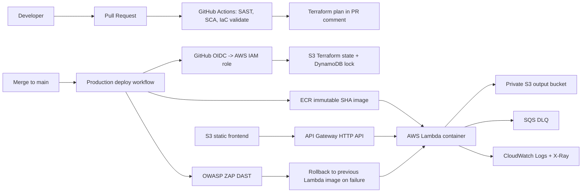

# Secure Serverless DevSecOps Pipeline for AWS Lambda

Reference implementation of a security-focused CI/CD pipeline for a
containerized AWS Lambda workload. The repository demonstrates how to combine
GitHub Actions, Terraform workspaces, AWS OIDC, immutable container images,
SAST, SCA, IaC scanning, container scanning, DAST, deployment validation, and
automatic Lambda rollback in one reproducible example.

The demo workload is a GIF preview generator: a static S3 frontend uploads a
base64-encoded video to API Gateway, Lambda runs FFmpeg, and generated GIFs are
written to a private S3 bucket behind presigned URLs.

## Architecture



## What Is Implemented

| Area | Implementation |
| --- | --- |
| Environments | `dev`, `staging`, and `prod` are mapped to Terraform workspaces. Resource names include the environment, for example `gif-generator-prod-lambda`. |
| Terraform state | Remote S3 backend with DynamoDB locking. `terraform/bootstrap` creates both prerequisites. |
| IaC structure | Root Terraform composes modules in `terraform/modules`: `kms`, `storage`, `ecr`, `lambda`, and `api-gateway`. |
| PR workflow | Pull requests run SAST/SCA/IaC validation and publish a Terraform plan as a PR comment plus artifact. |
| Main deploy | `terraform apply` runs only on `push` to `main`, which represents a merge path. Manual workflow runs can produce plans but do not apply. |
| Image deployment | ECR uses immutable tags. The workflow deploys `sha-<commit>` image URIs instead of mutable `latest`. |
| Rollback | The deploy job captures the previous Lambda image URI and restores it automatically if apply, smoke test, or DAST validation fails. |
| DAST | OWASP ZAP baseline scan runs against the deployed API after Lambda health checks pass. |
| Docker hardening | Multi-stage build, digest-pinned AWS Lambda base image, no build tools in runtime, and explicit non-root runtime user. |

## Repository Layout

```text
.github/workflows/deploy.yml        CI, PR plan, production deploy, rollback, DAST
terraform/bootstrap/                One-time S3 backend and DynamoDB lock table
terraform/modules/kms/              Customer-managed KMS key and alias
terraform/modules/storage/          S3 frontend/output/log buckets
terraform/modules/ecr/              Immutable ECR repository and lifecycle policy
terraform/modules/lambda/           Lambda, IAM role, logs, and SQS DLQ
terraform/modules/api-gateway/      HTTP API, integration, stage, access logs
lambda_function/                    Demo Python Lambda workload
frontend/                           Static browser client
docs/                               Security model, scanner rationale, costs, troubleshooting
```

## One-Time Backend Bootstrap

Terraform cannot create the S3 backend it is already using. Create the remote
state bucket and DynamoDB lock table once with the bootstrap stack:

```bash
cd terraform/bootstrap
terraform init
terraform apply \
  -var="state_bucket_name=<globally-unique-state-bucket>" \
  -var="lock_table_name=gif-generator-terraform-locks"
```

Copy the output values into `terraform/backend.tf`:

```hcl
terraform {
  backend "s3" {
    bucket               = "<globally-unique-state-bucket>"
    key                  = "serverless-lambda/terraform.tfstate"
    region               = "us-east-1"
    encrypt              = true
    dynamodb_table       = "gif-generator-terraform-locks"
    workspace_key_prefix = "environments"
  }
}
```

## Environment Workflow

Use Terraform workspaces for environment isolation:

```bash
cd terraform
terraform init
terraform workspace new dev
terraform workspace new staging
terraform workspace new prod
terraform workspace select dev
terraform plan -var="project_name=gif-generator"
```

The active workspace selects `environment_config` from
`terraform/variables.tf`. Running in the default workspace falls back to
`var.environment`, which defaults to `dev`.

## GitHub Actions Setup

Required repository secrets:

| Secret | Purpose |
| --- | --- |
| `AWS_ROLE_TO_ASSUME_ARN` | Deployment role used on `push` to `main`. |
| `AWS_PLAN_ROLE_TO_ASSUME_ARN` | Optional read/plan role for PR plans. Falls back to deploy role if omitted. |
| `AWS_REGION` | AWS region, for example `us-east-1`. |
| `SNYK_TOKEN` | Optional but recommended. Enables Snyk dependency and container gates. |

Optional repository variable:

| Variable | Default | Purpose |
| --- | --- | --- |
| `PROJECT_NAME` | `gif-generator` | Prefix for AWS resources and ECR repository names. |

Recommended branch protection for `main`:

* Require pull requests before merging.
* Require `Security and Terraform Validate` and `Terraform Plan` to pass.
* Restrict direct pushes to trusted maintainers or automation only.

## Pipeline Behavior

| Event | Environment | Terraform action | Deployment |
| --- | --- | --- | --- |
| Pull request to `main` | `dev` | `plan` only | No apply, no AWS mutation except workspace selection if missing. |
| Manual `workflow_dispatch` | selected `dev/staging/prod` | `plan` only | No apply. |
| Push to `main` | `prod` | `apply` | Build, scan, push immutable image, deploy Lambda, smoke test, DAST, frontend sync. |
| Push tag `v*.*.*` | n/a | n/a | Publish GitHub Release from `docs/release-<tag>.md` or `CHANGELOG.md`. |

## Deployment Flow

1. Validate code and Terraform formatting.
2. Run Bandit SAST, Snyk dependency scan, and Trivy IaC scan.
3. Apply only KMS and ECR bootstrap targets so the image repository exists.
4. Build a Linux amd64 Lambda image from the digest-pinned Dockerfile.
5. Scan the image with Snyk and push it to ECR as `sha-<commit>`.
6. Capture the previously deployed Lambda image URI.
7. Apply the full Terraform workload with the new immutable image URI.
8. Wait for Lambda, call `/health`, and run OWASP ZAP baseline DAST.
9. If deployment validation fails, update Lambda back to the previous image and
   re-apply Terraform with the previous URI to remove state drift.
10. Sync the frontend artifact to S3 only after backend validation succeeds.

## Useful Terraform Outputs

Example shape after a successful `prod` deploy:

```text
environment = "prod"
terraform_workspace = "prod"
api_gateway_health_url = "https://abc123.execute-api.us-east-1.amazonaws.com/health"
api_gateway_invoke_url = "https://abc123.execute-api.us-east-1.amazonaws.com/"
ecr_repository_name = "gif-generator-prod-lambda-repo"
ecr_repository_url = "123456789012.dkr.ecr.us-east-1.amazonaws.com/gif-generator-prod-lambda-repo"
frontend_s3_website_url = "http://gif-generator-prod-frontend-123456789012.s3-website-us-east-1.amazonaws.com"
lambda_function_name = "gif-generator-prod-lambda"
output_s3_bucket_name = "gif-generator-prod-output-gifs-123456789012"
```

## Demo API

Health check:

```bash
curl "$(terraform output -raw api_gateway_health_url)"
```

Generate a GIF preview:

```bash
base64 < test_video.mp4 | tr -d '\n' > video.b64
curl -X POST \
  --header "Content-Type: video/mp4" \
  --data-binary "@video.b64" \
  "$(terraform output -raw api_gateway_invoke_url)"
```

The response contains a presigned S3 URL for the generated GIF.

## Reference Documents

* [Security model](docs/security-model.md)
* [Scanning tool rationale](docs/scanning-tools.md)
* [AWS cost estimation](docs/cost-estimation.md)
* [Troubleshooting guide](docs/troubleshooting.md)
* [AWS OIDC and IAM policy guidance](AWS_policy.md)
* [Changelog](CHANGELOG.md)
* [v0.1.0 release notes](docs/release-v0.1.0.md)

## Current Limitations

* The public S3 website is intentionally simple for the reference
  implementation. Production systems should usually put CloudFront with OAC in
  front of S3.
* The API is unauthenticated to keep the demo focused on CI/CD controls.
  Add Cognito, IAM auth, JWT authorizers, or API keys before handling sensitive
  workloads.
* The Lambda container is pinned to x86_64 because FFmpeg is downloaded as an
  amd64 static build. ARM64 support is tracked as roadmap work.
