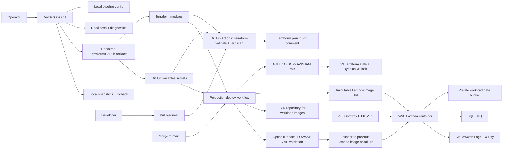

# DevSecOps Pipeline Kit CLI for AWS Lambda

DevSecOps Pipeline Kit is a terminal-first product for configuring,
validating, and operating a secure AWS Lambda deployment pipeline. The CLI is
the primary user interface; Terraform, GitHub Actions, AWS OIDC, scanners, and
rollback logic are the execution layer that the CLI configures and checks.

Use the CLI to build a local pipeline configuration, render Terraform and
GitHub helper artifacts, inspect readiness, diagnose GitHub/AWS setup gaps, and
recover from local configuration changes with snapshots.

This repository does not include sample Lambda application source code. The
pipeline expects a prebuilt immutable Lambda container image through
`LAMBDA_IMAGE_URI`.

## Architecture



## What Is Implemented

| Area | Implementation |
| --- | --- |
| CLI product | Dependency-free terminal menu, setup wizard, readiness dashboard, config presets, reports, snapshots, rollback, and diagnostics. |
| CLI-managed config | `.devsecops-pipeline.toml` stores local settings and `devsecops render` generates ignored Terraform/GitHub helper artifacts. |
| Readiness diagnostics | `devsecops readiness`, `[i] details`, `doctor`, `gh-doctor`, `actions-status`, and `branch-doctor` explain what blocks a deploy-ready pipeline. |
| AWS diagnostics | `devsecops aws-doctor` checks AWS identity, backend bucket, lock table, ECR, Lambda execution role, Lambda, API Gateway, CloudWatch logs, and configured ECR image existence. |
| Environments | `dev`, `staging`, and `prod` are mapped to Terraform workspaces. Resource names include the environment, for example `devsecops-pipeline-prod-lambda`. |
| Terraform state | Remote S3 backend with DynamoDB locking. `terraform/bootstrap` creates both prerequisites. |
| IaC structure | Root Terraform composes modules in `terraform/modules`: `kms`, `storage`, `ecr`, `lambda`, and `api-gateway`. |
| PR workflow | Pull requests run Terraform formatting, validation, Trivy IaC scanning, and publish a Terraform plan as a PR comment plus artifact. |
| Production deploy | `terraform apply` runs only from manual `workflow_dispatch` with `mode=deploy`, `environment=prod`, and the workflow run started from `main`. Direct pushes do not start Actions. |
| Image deployment | The deploy workflow requires `LAMBDA_IMAGE_URI` and rejects mutable `latest` or `bootstrap` tags. |
| Container scanning | Snyk can scan the configured image when `SNYK_TOKEN` is present. |
| Rollback | The deploy job captures the previous Lambda image URI and restores it automatically if apply or enabled validation fails. |
| Optional validation | `/health` smoke test and OWASP ZAP baseline DAST can be enabled with repository variables. |

## Repository Layout

```text
cli/                                Primary terminal product and tests
dist/devsecops/                     Ignored CLI-rendered helper artifacts
.github/workflows/deploy.yml        CI, PR plan, production deploy, rollback, optional DAST
terraform/bootstrap/                One-time S3 backend and DynamoDB lock table
terraform/modules/kms/              Customer-managed KMS key and alias
terraform/modules/storage/          Private workload data bucket and access log bucket
terraform/modules/ecr/              Immutable ECR repository and lifecycle policy
terraform/modules/lambda/           Lambda, IAM role, logs, and SQS DLQ
terraform/modules/api-gateway/      HTTP API, integration, stage, access logs
docs/                               CLI-first security, scanner, cost, and troubleshooting docs
```

## Quick Start

Start with the CLI:

```bash
python3 cli/devsecops_cli.py menu
```

The main menu uses section-style navigation: selecting an item clears the
terminal, opens that section, and returns to the main menu when you press
Enter. Input sections can be cancelled by typing `b`, `back`, `0`, or
`cancel`; the configuration wizard returns without saving when cancelled. The
readiness indicator includes an `[i] details` shortcut that shows the checks
blocking 100% readiness and the concrete fix for each one.

Install it as a local console command if preferred:

```bash
python3 -m pip install -e cli
devsecops menu
```

Recommended first run:

```bash
devsecops init
devsecops readiness
devsecops render
devsecops report
```

The CLI is intentionally dependency-free for core flows, so it can run before a
Python environment, Terraform backend, GitHub repository, or AWS credentials are
fully configured.

Useful commands:

```bash
devsecops dashboard     # one-screen terminal dashboard
devsecops init          # interactive setup wizard
devsecops preset list   # show available policy profiles
devsecops preset show strict
devsecops preset apply strict --render
devsecops doctor        # readiness report
devsecops readiness     # shows what blocks 100% readiness
devsecops doctor --deep # includes Terraform validate and AWS resource checks
devsecops envs          # environment settings table
devsecops controls      # security controls matrix
devsecops render        # writes ignored Terraform/GitHub helper artifacts
devsecops report        # exports Markdown readiness report
devsecops snapshots     # lists local restore snapshots
devsecops rollback --last --dry-run # previews rollback to the newest snapshot
devsecops github-setup  # prints gh commands for repo variables/secrets
devsecops gh-setup --apply --deploy-role-arn arn:aws:iam::123456789012:role/deploy
devsecops gh-doctor     # checks GitHub variables/secrets through gh
devsecops aws-doctor    # checks AWS identity, backend, and deployed resources
devsecops gh-status     # shows recent GitHub Actions runs
devsecops actions-status # shows recent runs and failed jobs
devsecops branch-doctor # checks main branch protection
devsecops set backend.bucket my-state-bucket --render
devsecops plan dev --create-workspace
devsecops explain oidc  # explains a security control
```

The wizard writes `.devsecops-pipeline.toml`, which is intentionally ignored by
Git. `devsecops render` writes:

```text
terraform/generated.auto.tfvars
dist/devsecops/backend.tf
dist/devsecops/github-variables.env
dist/devsecops/github-setup.sh
dist/devsecops/setup-checklist.md
```

`devsecops report` writes `dist/devsecops/readiness-report.md`.

The CLI creates local snapshots before commands that overwrite CLI-owned
configuration or generated artifacts: `init`, `set`, `preset`, `render`,
`report`, and `github-setup --write`. Snapshots are stored under
`.devsecops/snapshots/`, are ignored by Git, and can be inspected or restored:

```bash
devsecops snapshots
devsecops snapshots --show 1
devsecops rollback --last --dry-run
devsecops rollback --to <number-or-id>
```

Rollback restores only the local files managed by the CLI, such as
`.devsecops-pipeline.toml`, `terraform/generated.auto.tfvars`, and generated
files under `dist/devsecops/`. Before a rollback is applied, the CLI creates a
new safety snapshot of the current state.

The `set` command supports non-interactive configuration for scripts and quick
edits:

```bash
devsecops set lambda_image_uri 123456789012.dkr.ecr.us-east-1.amazonaws.com/app:sha-a1b2c3
devsecops set enable_dast true
devsecops set environments.prod.lambda_timeout 300 --render
devsecops validate-config
```

Presets provide a quick starting point:

```bash
devsecops preset list
devsecops preset show enterprise
devsecops preset apply minimal --render       # low-cost local/dev experimentation
devsecops preset apply balanced --render      # default reference settings
devsecops preset apply strict --render        # enables health validation and DAST
devsecops preset apply enterprise --render    # locked-down CORS and longer retention
devsecops preset apply student-demo --render  # simple demonstration profile
```

For compatibility, `devsecops preset strict --render` still applies the named
preset, but new scripts should use `devsecops preset apply <name>`.

## CLI-Managed Backend Bootstrap

Terraform cannot create the S3 backend it is already using. Configure the
backend values through the CLI, render helper artifacts, and let the CLI run the
bootstrap stack:

```bash
devsecops set backend.bucket <globally-unique-state-bucket> --render
devsecops set backend.lock_table devsecops-pipeline-terraform-locks --render
devsecops bootstrap
devsecops bootstrap --apply
```

`devsecops bootstrap` plans by default. Use `--apply` only after reviewing the
target AWS account, bucket name, and lock table name.

The rendered backend template is written to `dist/devsecops/backend.tf`. Copy
or adapt it into `terraform/backend.tf` when you are ready to initialize the
root Terraform module:

```hcl
terraform {
  backend "s3" {
    bucket               = "<globally-unique-state-bucket>"
    key                  = "serverless-lambda/terraform.tfstate"
    region               = "us-east-1"
    encrypt              = true
    dynamodb_table       = "devsecops-pipeline-terraform-locks"
    workspace_key_prefix = "environments"
  }
}
```

## Environment Workflow

Use the CLI for the normal environment workflow:

```bash
devsecops envs
devsecops preset apply balanced --render
devsecops plan dev --create-workspace
devsecops plan staging --create-workspace
devsecops plan prod --create-workspace
```

The CLI delegates to Terraform workspaces under the hood. The active workspace
selects `environment_config` from `terraform/variables.tf`. Running in the
default workspace falls back to `var.environment`, which defaults to `dev`.

## GitHub Actions Setup

Generate repository setup commands from the same local config used by
Terraform:

```bash
devsecops github-setup --write
devsecops gh-setup --apply \
  --deploy-role-arn arn:aws:iam::<account-id>:role/<deploy-role> \
  --plan-role-arn arn:aws:iam::<account-id>:role/<plan-role>
devsecops gh-doctor
devsecops branch-doctor
devsecops aws-doctor --environment prod
```

Required repository secrets:

| Secret | Purpose |
| --- | --- |
| `AWS_ROLE_TO_ASSUME_ARN` | Deployment role used by manual production deploy runs from `main`. |
| `AWS_PLAN_ROLE_TO_ASSUME_ARN` | Optional read/plan role for PR plans. Falls back to deploy role if omitted. |
| `AWS_REGION` | AWS region, for example `us-east-1`. |
| `SNYK_TOKEN` | Optional. Enables Snyk container scanning for the configured Lambda image. |

Repository variables:

| Variable | Default | Purpose |
| --- | --- | --- |
| `PROJECT_NAME` | `devsecops-pipeline` | Prefix for AWS resources and ECR repository names. |
| `LAMBDA_IMAGE_URI` | none | Required for manual production deploy. Immutable image URI deployed to Lambda. |
| `ENABLE_HTTP_VALIDATION` | `false` | When `true`, CI calls the API Gateway `/health` URL after deployment. |
| `ENABLE_DAST` | `false` | When `true`, CI runs OWASP ZAP baseline scan against the API Gateway invoke URL. |

Recommended branch protection for `main`:

* Require pull requests before merging.
* Require `Security and Terraform Validate` and `Terraform Plan` to pass.
* Use pull requests for automatic validation. Direct pushes to `main` do not
  run this workflow.

## Pipeline Behavior

| Event | Environment | Terraform action | Deployment |
| --- | --- | --- | --- |
| Pull request to `main` | `dev` | `plan` only | No apply, no AWS mutation except workspace selection if missing. |
| Push to `main` | n/a | none | No workflow run. Maintainer pushes do not consume Actions minutes. |
| Manual `workflow_dispatch`, `mode=plan` | selected `dev/staging/prod` | `plan` only | No apply. |
| Manual `workflow_dispatch`, `mode=deploy`, `environment=prod`, branch `main` | `prod` | `apply` | Scan configured image when enabled, deploy Lambda, optionally validate HTTP and DAST, rollback on failure. |
| Push tag `v*.*.*` | n/a | n/a | Publish GitHub Release from `docs/release-<tag>.md` or `CHANGELOG.md`. |

## Deployment Flow

1. Configure local pipeline state with `devsecops init`, `set`, or `preset`.
2. Render generated artifacts with `devsecops render`.
3. Check readiness with `devsecops readiness`, `doctor`, and GitHub diagnostics.
4. Validate Terraform formatting and configuration in GitHub Actions on pull
   requests or manual runs.
5. Run Trivy IaC scanning.
6. Require an immutable `LAMBDA_IMAGE_URI` on production deploys.
7. Optionally scan the configured Lambda image with Snyk.
8. Apply KMS and ECR bootstrap targets so supporting resources exist.
9. Capture the previously deployed Lambda image URI.
10. Start a manual `workflow_dispatch` run with `mode=deploy` and
    `environment=prod` from `main`.
11. Apply the full Terraform workload with the configured image URI.
12. Wait for the Lambda update to complete.
13. Optionally call `/health` and run OWASP ZAP baseline DAST.
14. If deployment validation fails, update Lambda back to the previous image
    and re-apply Terraform with the previous URI to remove state drift.

## Workload Image Contract

The supplied image must be compatible with Lambda container package type and
must be published before the production deploy workflow runs. Use immutable tags
or image digests; do not use `latest`.

If `ENABLE_HTTP_VALIDATION=true`, the image must handle API Gateway HTTP API
events and return a successful response for `GET /health`. If
`ENABLE_DAST=true`, the API should be safe for a passive OWASP ZAP baseline
scan.

## Useful Terraform Outputs

Example shape after a successful `prod` deploy:

```text
environment = "prod"
terraform_workspace = "prod"
api_gateway_health_url = "https://abc123.execute-api.us-east-1.amazonaws.com/health"
api_gateway_invoke_url = "https://abc123.execute-api.us-east-1.amazonaws.com/"
ecr_repository_name = "devsecops-pipeline-prod-lambda-repo"
ecr_repository_url = "123456789012.dkr.ecr.us-east-1.amazonaws.com/devsecops-pipeline-prod-lambda-repo"
lambda_function_name = "devsecops-pipeline-prod-lambda"
output_s3_bucket_name = "devsecops-pipeline-prod-workload-data-123456789012"
```

Health check, when the workload implements `/health`:

```bash
curl "$(terraform output -raw api_gateway_health_url)"
```

## Reference Documents

* [Security model](docs/security-model.md)
* [Scanning tool rationale](docs/scanning-tools.md)
* [AWS cost estimation](docs/cost-estimation.md)
* [Troubleshooting guide](docs/troubleshooting.md)
* [AWS OIDC and IAM policy guidance](AWS_policy.md)
* [Changelog](CHANGELOG.md)
* [v0.1.0 release notes](docs/release-v0.1.0.md)

## Current Limitations

* Application source, dependency scanning, and image build logic are expected to
  live in the workload repository or an upstream release workflow.
* The CLI is the product surface, but Terraform and GitHub Actions remain the
  execution layer. Advanced operators may still need to inspect Terraform plans
  and workflow logs directly.
* The API is unauthenticated to keep the kit focused on pipeline controls. Add
  Cognito, IAM auth, JWT authorizers, or API keys before handling sensitive
  workloads.
* Optional DAST is a passive baseline scan only. Authenticated flows and
  business-logic checks need workload-specific tests.
