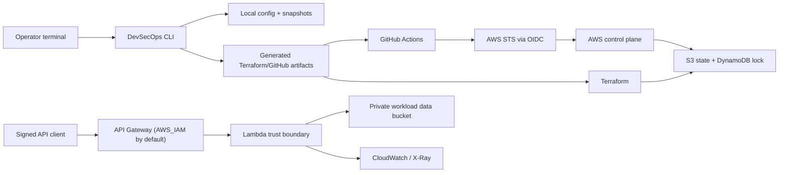

# Security Model

This document describes the threat model and security controls for the
CLI-first DevSecOps Pipeline Kit. It complements `SECURITY.md`, which remains
the project-level security policy.

## Assets

| Asset | Why it matters |
| --- | --- |
| DevSecOps CLI | Primary product interface for configuration, readiness checks, generated artifacts, and local rollback. |
| Local CLI config | `.devsecops-pipeline.toml` drives rendered Terraform and GitHub setup artifacts. Bad values can produce bad plans. |
| Local snapshots | `.devsecops/snapshots/` can restore CLI-owned files, but may contain local operational values. |
| Generated helper artifacts | Files under `dist/devsecops/` and generated tfvars bridge the CLI and execution layer. |
| Terraform state | Contains resource identifiers and may contain sensitive configuration. Corruption can break deployments. |
| GitHub OIDC role | Grants CI temporary AWS credentials. Mis-scoping can become cloud account access. |
| Lambda workload image | Defines production runtime code supplied through `LAMBDA_IMAGE_URI`. |
| Lambda execution role | Has access to workload data, KMS, logs, X-Ray, and DLQ publishing. |
| Workload data S3 bucket | Private bucket available to the Lambda runtime for workload-specific data. |
| API Gateway endpoint | IAM-protected ingress point for untrusted input unless the operator explicitly sets public route authorization. |
| CloudWatch logs and DLQ | Operational evidence; may accidentally contain sensitive metadata if logging expands. |

## Trust Boundaries

## Threats And Controls

| Threat | Control |
| --- | --- |
| Accidental local config overwrite | CLI creates snapshots before overwriting CLI-owned config or generated artifacts. |
| Restoring the wrong local state | Rollback shows snapshot details and change summaries, requires confirmation, and creates a safety snapshot before restore. |
| Committing local operational data | `.devsecops-pipeline.toml`, `.devsecops/`, generated tfvars, and `dist/` artifacts are ignored by Git. |
| Misconfigured pipeline hidden from operator | `devsecops readiness`, `[i] details`, `doctor`, and reports show scored readiness gaps and concrete fix actions. |
| Security controls hidden in Terraform or workflows | `devsecops controls`, `devsecops explain <control>`, and `docs/security-controls.md` map CLI options to generated Terraform, GitHub, AWS, and scanner behavior. |
| Static cloud credentials leaked from CI | GitHub Actions uses OIDC and short-lived STS credentials; no AWS access keys are stored in the repo. |
| Overprivileged PR planning | Terraform plan workflows require `AWS_PLAN_ROLE_TO_ASSUME_ARN`, skip forked PRs, and do not fall back to the deploy role. |
| Unauthorized Terraform apply | Workflow applies only on manual `workflow_dispatch` deploy runs from `main`; PRs and direct pushes do not apply. Protect `main` with required checks. |
| Concurrent Terraform state writes | S3 backend uses DynamoDB state locking. Bootstrap stack creates the lock table. |
| Insecure Terraform configuration | Trivy scans Terraform modules for high and critical IaC findings. |
| Vulnerable container image | Snyk can scan the configured Lambda image before deploy when `SNYK_TOKEN` is configured. |
| Mutable or accidental image deployment | Deploy workflow and Terraform require an explicit immutable ECR `LAMBDA_IMAGE_URI` and reject `latest` and `bootstrap` tags. |
| Unauthenticated production API exposure | API Gateway routes default to `AWS_IAM`; `NONE` must be explicitly configured for demos or intentionally public APIs. |
| Failed or unhealthy Lambda deployment | Deploy job captures the previous image URI and rolls Lambda back if apply or enabled validation fails. |
| Runtime data exposure | Workload data is stored in a private S3 bucket with public access blocked and non-TLS requests denied. |
| Weak encryption at rest | Workload data stores use KMS where compatible. |
| Missing dynamic testing | OWASP ZAP baseline can run after deploy against explicitly public APIs when `ENABLE_DAST=true` and `API_AUTHORIZATION_TYPE=NONE`. |
| Missing audit evidence | `devsecops report --format json` writes attachable control, readiness, validation, preset, and least-privilege evidence. |

## Tool Responsibility

| Tool | Protects against | Does not protect against |
| --- | --- | --- |
| DevSecOps CLI | Misconfiguration drift, missing setup steps, unsafe local overwrites, and unclear readiness gaps. | Malicious local operators, compromised terminals, or AWS/GitHub permissions outside the configured pipeline. |
| CLI snapshots | Accidental local config/generated artifact changes. | Terraform state rollback, cloud resource rollback, or secrets exposed outside ignored local files. |
| Snyk Container | Known CVEs in the configured container image. | Source-level flaws and private package issues not present in the image metadata. |
| Trivy | Terraform/AWS misconfigurations before apply. | Runtime-only behavior and API-level vulnerabilities. |
| OWASP ZAP | Passive dynamic findings on an explicitly public deployed HTTP surface. | IAM-protected APIs, authenticated flows, deep business logic, and non-HTTP risks. |
| Terraform workspaces | Environment state isolation. | Account-level isolation; use separate AWS accounts for stronger production boundaries. |
| DynamoDB locking | Parallel state mutation. | Bad plans, overprivileged IAM, or manual console drift. |

## Residual Risks

* API Gateway defaults to IAM authorization, but application-level identity,
  tenant isolation, and business authorization remain workload responsibilities.
* Application source scanning, dependency scanning, test coverage, and image
  build hardening are expected to happen before publishing `LAMBDA_IMAGE_URI`.
* CLI snapshots are local safety artifacts, not a substitute for Git history,
  Terraform state backups, or cloud rollback strategy.
* Lambda DLQ only captures asynchronous invocation failures. API Gateway
  synchronous errors are returned to the client and logged in CloudWatch.
* PR Terraform plan requires a lower-privilege `AWS_PLAN_ROLE_TO_ASSUME_ARN`.
  Forked PRs intentionally do not receive AWS-backed plans.
