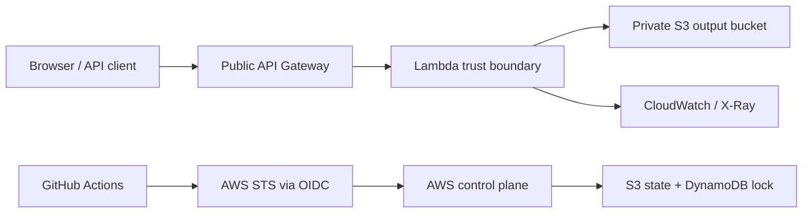

# Security Model

This document describes the threat model and security controls for the
reference implementation. It complements `SECURITY.md`, which remains the
project-level security policy.

## Assets

| Asset | Why it matters |
| --- | --- |
| Terraform state | Contains resource identifiers and may contain sensitive configuration. Corruption can break deployments. |
| GitHub OIDC role | Grants CI temporary AWS credentials. Mis-scoping can become cloud account access. |
| ECR Lambda image | Defines production runtime code and native FFmpeg binary. |
| Lambda execution role | Has access to S3 output objects, KMS, logs, X-Ray, and DLQ publishing. |
| Output S3 bucket | Stores generated GIF files. Objects are private and exposed through presigned URLs. |
| API Gateway endpoint | Public ingress point for untrusted input. |
| CloudWatch logs and DLQ | Operational evidence; may accidentally contain sensitive metadata if logging expands. |

## Trust Boundaries

## Threats And Controls

| Threat | Control |
| --- | --- |
| Static cloud credentials leaked from CI | GitHub Actions uses OIDC and short-lived STS credentials; no AWS access keys are stored in the repo. |
| Unauthorized Terraform apply | Workflow applies only on `push` to `main`; PRs and manual dispatch produce plans only. Protect `main` with required checks. |
| Concurrent Terraform state writes | S3 backend uses DynamoDB state locking. Bootstrap stack creates the lock table. |
| Malicious or vulnerable Python code | Bandit runs SAST on Lambda source before plan/deploy. |
| Vulnerable dependencies | Snyk scans `lambda_function/requirements.txt`; Dependabot monitors pip updates. |
| Insecure Terraform configuration | Trivy scans Terraform modules for high and critical IaC findings. |
| Vulnerable container image | Docker image is built from a digest-pinned AWS Lambda base image, scanned before push, and stored in ECR with immutable tags. |
| Failed or unhealthy Lambda deployment | Deploy job captures the previous image URI and rolls Lambda back if apply, smoke test, or DAST validation fails. |
| Runtime data exposure | Generated GIFs are stored in a private S3 bucket and returned through time-limited presigned URLs. |
| Excessive public storage access | Only the frontend website bucket is public. Output and log buckets block public access. |
| Weak encryption at rest | Workload data stores use KMS where compatible. The public frontend bucket uses SSE-S3 so anonymous S3 website reads still work. |
| Missing dynamic testing | OWASP ZAP baseline runs after deploy against the live API. |

## Tool Responsibility

| Tool | Protects against | Does not protect against |
| --- | --- | --- |
| Bandit | Common Python security mistakes and risky APIs. | Business logic flaws and dependency CVEs. |
| Snyk | Known dependency and container CVEs. | Newly introduced zero-days and misconfigured AWS resources. |
| Trivy | Terraform/AWS misconfigurations before apply. | Runtime-only behavior and API-level vulnerabilities. |
| OWASP ZAP | Passive dynamic findings on the deployed HTTP surface. | Authenticated flows, deep business logic, and non-HTTP risks. |
| Terraform workspaces | Environment state isolation. | Account-level isolation; use separate AWS accounts for stronger production boundaries. |
| DynamoDB locking | Parallel state mutation. | Bad plans, overprivileged IAM, or manual console drift. |

## Residual Risks

* API Gateway is intentionally unauthenticated. Add an authorizer before using
  this pattern for sensitive or high-abuse workloads.
* S3 static website hosting requires public read. A production variant should
  use CloudFront Origin Access Control and block public S3 access entirely.
* FFmpeg is downloaded as a static binary. Container scanning may not detect
  every vulnerability in that binary, so maintainers must periodically review
  FFmpeg releases.
* Lambda DLQ only captures asynchronous invocation failures. API Gateway
  synchronous errors are returned to the client and logged in CloudWatch.
* PR Terraform plan requires an AWS role. Use a lower-privilege
  `AWS_PLAN_ROLE_TO_ASSUME_ARN` when accepting external contributions.
